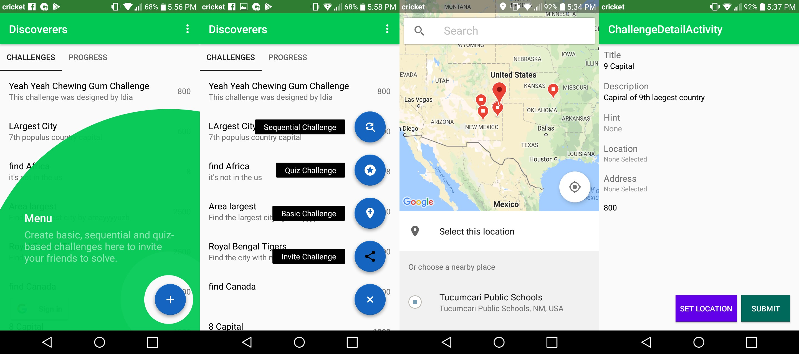
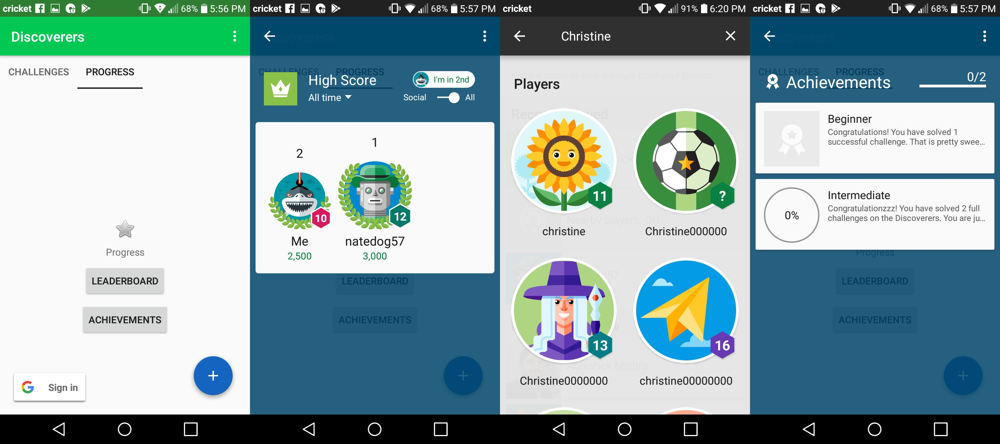

# Discoverers

### Challenging

Discoverers is a collaborative multiplayer game and a community of learners that enjoy casual gaming and those that want to learn more about the World. The players learn together by creating, sharing and solving challenges with one-another. The challenges are reviewed by the developers of the app before they are placed into the pool of quality challenges to solve.

### Multiplayer

The app allows the players to create, share, delete and review challenges with an intuitive User Interface. The game uses the Google Places API to allow the players to choose a location from anywhere on the Earth to either create or solve a challenge.

### Google APIs Used

* Google Maps API
* Google Places API
* Google Play Games Services
* Firebase

### Future Plans for Expansion

Plans are to use the following APIs to expand the pool of features available to the players and enhance their experience of solving and sharing challenges.

* Google Street View 3D API
* Google Pay
* Google Analytics

### Developers

Bhavyansh Mishra and Nathan Cooper